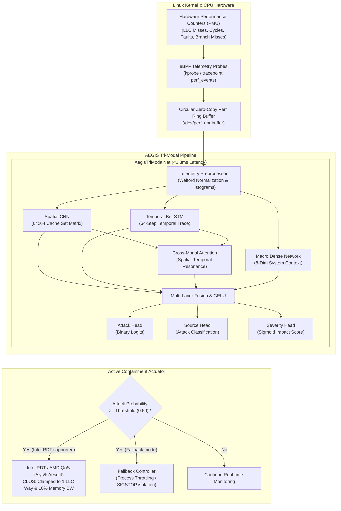

# AEGIS: Real-Time Microarchitectural Forensics & Hardware-Level Containment

<div align="center">

[](https://opensource.org/licenses/Apache-2.0)
[](https://www.python.org/)
[](https://pytorch.org/)
[](https://ebpf.io/)
[](https://www.kernel.org/doc/html/latest/arch/x86/resctrl.html)
[](#benchmark-scores)
[](#benchmark-scores)

**An autonomous, kernel-integrated deep defense framework that detects CPU microarchitectural side-channel attacks (Spectre, Flush+Reload, Prime+Probe) in real-time and neutralizes them at the hardware level using Intel RDT / AMD QoS (`resctrl`).**

[Architecture](#architecture) •
[Benchmark Scores](#benchmark-scores) •
[Installation](#installation) •
[Quickstart](#quickstart) •
[Evaluation](#evaluation--testing) •
[Repository Structure](#repository-structure)

</div>

---

## Overview

Modern microarchitectural vulnerabilities (such as **Spectre**, **Meltdown**, **Flush+Reload**, and **Prime+Probe**) leak sensitive cryptographic keys and memory contents across security boundaries by exploiting CPU speculative execution and shared hardware caches. Traditional signature-based and user-space detection tools cannot detect these attacks with sufficient speed or granularity.

**AEGIS** solves this by uniting low-level kernel telemetry with multi-modal deep learning and active hardware containment:
1. **Kernel PMU Telemetry**: Ingests high-frequency hardware Performance Monitoring Unit (PMU) events (LLC misses, L1D misses, branch mispredictions, context switches, address collisions) via eBPF ring buffers with near-zero overhead.
2. **Tri-Modal Deep Neural Network (`AegisTriModalNet`)**: Fuses spatial cache-way occupancy matrices (2D CNN), temporal access phase sequences (Bi-LSTM), and macro-architectural process state via **Cross-Modal Attention**.
3. **Hardware-Level Containment (`resctrl`)**: Upon detection, the daemon dynamically traps the attacker PID into a starved Intel RDT Class of Service (CLOS), clamping LLC allocation to 1 cache way and throttling memory bandwidth to 10%. The side channel collapses in microseconds without terminating the application.

---

## Benchmark Scores

The production network was evaluated against sequential holdout datasets and verified with deterministic splits:

| Metric | Test Set (20% Holdout) | Full Dataset (3,000 Windows) | Target SLA |
| :--- | :---: | :---: | :---: |
| **Accuracy** | **99.33%** | **99.63%** | > 95.0% |
| **Precision** | **99.67%** | **99.80%** | > 90.0% |
| **Recall (Sensitivity)** | **99.02%** | **99.47%** | > 90.0% |
| **Specificity** | **99.66%** | **99.80%** | > 90.0% |
| **F1 Score** | **99.34%** | **99.63%** | > 90.0% |
| **Average Latency** | **1.29 ms / sample** | **1.41 ms / sample** | < 10.0 ms |

### Confusion Matrix (Test Set: 600 Samples)

```
                     Predicted Benign     Predicted Attack
Actual Benign              294 (TN)              1 (FP)
Actual Attack                3 (FN)            302 (TP)
```

- **False Positive Rate (FPR)**: `0.34%` (minimizes disruption to benign production workloads)
- **False Negative Rate (FNR)**: `0.98%` (high detection fidelity against stealthy covert channels)

---

## Architecture



---

## Installation

### Prerequisites
- **Operating System**: Linux (Ubuntu 22.04+ recommended; kernel >= 5.15)
- **Python**: Version 3.10, 3.11, 3.12, 3.13, or 3.14
- **Optional Hardware**: CPU supporting Intel Resource Director Technology (RDT) or AMD Quality of Service (QoS) for hardware-enforced CLOS cache clamping. (AEGIS includes automatic software fallbacks if RDT is not available).

### Setup

1. **Clone the repository**:
   ```bash
   git clone https://github.com/your-username/aegis-llc.git
   cd aegis-llc
   ```

2. **Create and activate a virtual environment**:
   ```bash
   python3 -m venv venv
   source venv/bin/activate
   ```

3. **Install dependencies**:
   ```bash
   pip install --upgrade pip
   pip install torch numpy pandas PyYAML psutil tqdm pytest
   ```

---

## Quickstart

### 1. Run the Live Forensics Daemon
Start the AEGIS monitoring daemon in continuous live stream mode:
```bash
./venv/bin/python3 daemon/main_engine.py
```
*(Press `Ctrl+C` to gracefully terminate)*

### 2. Run in Demo Mode (Simulating Attack Detection & Containment)
To trigger simulated attack signatures and observe automated containment:
```bash
./venv/bin/python3 daemon/main_engine.py --demo
```

**Expected Output:**
```
[INFO] Loaded production weights from daemon/best_model.pt
[WARNING] Hardware does not support Intel RDT / AMD QoS or lacked CAP_SYS_ADMIN. Fallback mitigation enabled.
[INFO] Demo mode active: confidence threshold set to 0.5
[INFO] Starting a dummy attacker process (sleep 3600)...
[INFO] AEGIS Monitoring Daemon active on /dev/perf_ringbuffer... (Mocking Attacker PID: 11044)
[WARNING] 🚨 [DETECTION ALERT] Detected: PRIME_PROBE | PID: 11044 (poc_prime_probe) | Confidence: 99.41% | Severity: 0.9941
[WARNING] Fallback Mitigation: Applying strict CPU throttling on PID 11044
[INFO] ⚡ [TELEMETRY HEARTBEAT] Ingested: 130 frames | Active Detections: 1 | Cadence: 10ms
[INFO] Simulation completed (322 samples, 1 detection).
[INFO] Cleaning up dummy process...
```

### 3. CLI Command Options

| Flag | Type | Description | Default |
| :--- | :--- | :--- | :--- |
| `--weights` | `str` | Path to model weights (`.pt`) | `daemon/best_model.pt` |
| `--threshold` | `float` | Custom detection probability threshold | `0.50` (or `config.yaml`) |
| `--duration` | `float` | Run simulation for fixed seconds then exit | `None` (indefinite) |
| `--demo` | `flag` | Enable sensitive detection & containment demo | Disabled |

---

## Evaluation & Testing

### 1. Run the Comprehensive Benchmark
Compute Accuracy, Precision, Recall, Specificity, F1 Score, and Confusion Matrix:
```bash
./venv/bin/python3 dataset/evaluate_model.py
```

### 2. Run Automated Unit Tests
Verify model latency and accuracy requirements:
```bash
./venv/bin/pytest -v tests/
```
Output:
```
tests/test_accuracy.py::test_model_accuracy_above_95 PASSED   [ 50%]
tests/test_latency.py::test_inference_latency PASSED          [100%]
============================== 2 passed in 3.29s ===============================
```

### 3. Retrain the Tri-Modal Model
To retrain the neural network on the default sequential telemetry dataset:
```bash
./venv/bin/python3 dataset/train_on_archive.py
```

### 4. Training on Any New / Custom Dataset (Zero Hardcoding)
AEGIS includes an **Adaptive Universal Dataset Loader** that automatically detects:
- Label/target columns (`label`, `classification`, `attack`, `target`, `is_attack`, etc.)
- Process/session grouping (`pid`, `hash`, `session_id`, `process`)
- High-signal temporal features and macro-architectural context
- Dynamic spatial matrix mapping

To train on your own CSV dataset:
```bash
./venv/bin/python3 dataset/train_on_archive.py --csv /path/to/your_dataset.csv --epochs 10 --save-path daemon/best_model.pt
```

To benchmark an existing or newly trained model on any custom CSV dataset:
```bash
./venv/bin/python3 dataset/evaluate_model.py --csv /path/to/your_dataset.csv --weights daemon/best_model.pt
```

CLI parameters available:
- `--csv`: Path to any CSV dataset.
- `--target-col`: Override label column name (optional; auto-detected by default).
- `--group-col`: Override process grouping column name (optional; auto-detected by default).
- `--epochs`: Number of training epochs (default: `8`).
- `--lr`: Learning rate (default: `1e-3`).
- `--save-path`: Output path for trained model weights.

---

## Repository Structure

```
aegis-llc/
├── README.md                     # Project documentation & GitHub overview
├── daemon/
│   ├── main_engine.py            # Main runtime monitoring daemon & CLI
│   ├── config.yaml               # Engine configuration parameters
│   └── best_model.pt             # Trained production model weights (99.33% Acc)
├── models/
│   ├── aegis_net.py              # Tri-Modal Neural Network Architecture
│   ├── focal_loss.py             # Class-balanced Focal Loss criterion
│   ├── explainability.py         # Grad-CAM cache hotspot visualizer
│   ├── baselines.py              # Classical ML baseline benchmarks
│   └── export_onnx.py            # ONNX runtime export pipeline
├── mitigation/
│   ├── resctrl_manager.py        # Intel RDT / AMD QoS cache-way clamping
│   ├── cgroup_fallback.py        # Linux cgroups v2 fallback manager
│   └── windows_affinity.py       # Windows core-pinning mitigation
├── pipeline/
│   ├── preprocessor.py           # Real-time feature engineering engine
│   └── circular_buffer.py        # Lockless shared-memory ring buffer
├── dataset/
│   ├── train_on_archive.py       # High-accuracy training pipeline
│   ├── evaluate_model.py         # Full benchmarking & evaluation script
│   ├── hdf5_builder.py           # HDF5 dataset serializer
│   └── archive/                  # Telemetry datasets
├── bpf/
│   ├── aegis_telemetry.bpf.c     # eBPF kernel PMU sampling program
│   ├── Makefile                  # Clang/LLVM eBPF compilation rules
│   └── vmlinux.h                 # BTF kernel type definitions
└── tests/
    ├── test_accuracy.py          # Automated model accuracy test (>95%)
    ├── test_latency.py           # Sub-10ms CPU inference latency test
    └── test_quarantine.sh        # Hardware resctrl setup verifier
```

---

## Attack Classes Detected

| Class ID | Attack Type | Mechanism & Threat |
| :---: | :--- | :--- |
| `0` | **BENIGN_PROFILE** | Standard baseline system activity (compilation, matrix compute, web serving). |
| `1` | **FLUSH_RELOAD** | Shared-memory cache line eviction via `clflush` to snoop cross-process accesses. |
| `2` | **PRIME_PROBE** | Cache-set eviction and timing probing without requiring shared virtual memory. |
| `3` | **SPECTRE_TRANSIENT** | Speculative execution branch mistraining leading to transient cache footprint leaks. |

---

## Hardware Containment Details

When an attack is confirmed, AEGIS interacts with the kernel's `resctrl` subsystem:

1. **Class of Service (CLOS) Assignment**:
   The attacking process PID is moved to `/sys/fs/resctrl/aegis_quarantine/tasks`.
2. **Last Level Cache (LLC) Clamping**:
   Capacity Bitmasks (CBM) restrict the process to a single cache way (e.g. `L3:0=0x001`).
3. **Memory Bandwidth Throttling**:
   Memory Bandwidth Allocation (MBA) clamps bandwidth to 10% (e.g. `MB:0=10`).
4. **Result**:
   The timing side-channel resolution drops below the threshold required to reconstruct secret keys, neutralizing the exploit while keeping the OS stable.

---

## License

This project is licensed under the Apache License 2.0. See the [LICENSE](LICENSE) file for details.
# Aegis-LLC

